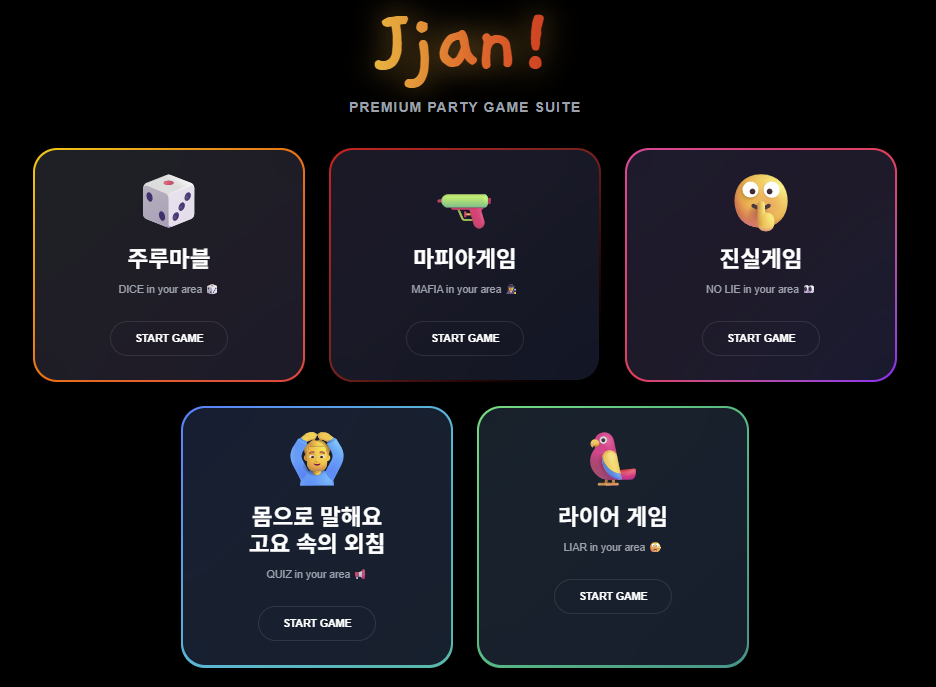
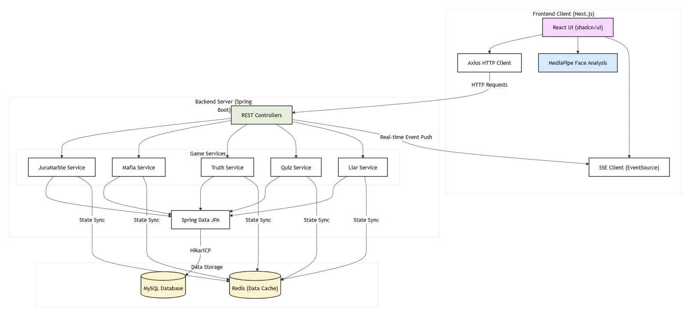

<h1 align="left">Jjan!</h1>

<div align="center">
  

  <p>
    <strong>오프라인 술자리의 흐름을 끊지 않고, 모바일 웹 하나로 즐기는 레크리에이션 플랫폼</strong>
  </p>
</div>

---

## Frontend Repository
[https://github.com/Osssai-52/Jjan-](https://github.com/Osssai-52/Jjan-)

---

## Service Overview

### Background
- 오프라인 술자리에서 게임 준비, 사회자 역할, 대화 주제 고갈 등으로 흐름이 끊기는 문제를 해결하고
- 별도의 준비물 없이 모바일 웹 하나로 레크레이션을 간편하게 진행하여 분위기를 자연스럽게 띄워주자!

### Target User
- 몰입캠프 엠티를 가는 사람들

---

## Tech Stack

### Frontend
| Category | Technology | Description |
| :--- | :--- | :--- |
| **Core Framework** | **Next.js (App Router)** | 호스트 및 플레이어 페이지 라우팅 및 전반적인 웹 구조 설계 |
| **Language** | **TypeScript** | 정적 타입 체크를 통한 복잡한 게임 로직의 안정성 및 유지보수성 확보 |
| **Styling** | **Tailwind CSS** | 유틸리티 기반 클래스를 활용한 다크 모드 UI 및 반응형 디자인 구현 |
| **Real-time Sync** | **SSE (Server-Sent Events)** | 호스트-플레이어 간 게임 상태(주사위, 페이즈 등) 실시간 동기화 |
| **AI Vision Engine** | **MediaPipe (Face Landmarker)** | 브라우저 환경 내 실시간 얼굴 트래킹 및 표정 데이터 추출 (진실게임) |
| **Animation** | **Framer Motion** | 3D 주사위, 모달, 화면 전환 등 몰입감 있는 인터랙션 구현 |
| **Data Fetching** | **Axios** | 백엔드 API 서버와의 비동기 HTTP 통신 및 에러 핸들링 |
| **UI Components** | **shadcn/ui** | 재사용 가능한 고품질 UI 컴포넌트를 활용한 개발 효율성 증대 |

### Backend
| Category | Technology | Description |
| :--- | :--- | :--- |
| **Core Framework** | **Spring Boot** | 비즈니스 로직 처리 및 REST API 구축을 위한 핵심 프레임워크 |
| **Language** | **Java** | 안정적이고 확장성 있는 서버 측 로직 구현을 위한 주력 언어 |
| **Database (RDB)** | **MySQL** | 사용자 데이터, 벌칙 정보 등 정형 데이터 저장을 위한 DB |
| **Persistence** | **Spring Data JPA** | Hibernate 기반의 객체-DB 매핑 및 데이터 조작 자동화 |
| **Caching / Session** | **Redis** | 실시간 게임 세션 관리 및 빠른 데이터 접근을 위한 인메모리 저장소 |
| **Connection Pool** | **HikariCP** | 고성능 JDBC 커넥션 풀을 통한 데이터베이스 연결 최적화 |
| **Build Tool** | **Gradle** | 프로젝트 의존성 관리 및 빌드 자동화 |
| **Real-time Sync** | **SSE (Server-Sent Events)** | 클라이언트에게 실시간 게임 상태 변화를 전달하는 통신 방식 |

---

## System Architecture



---

## Key Features
### 1. 주루마블
### 2. 마피아게임
### 3. 진실게임
### 4. 몸으로 말해요/고요 속의 외침
### 5. 라이어게임

---

## Developers

| [@ujinchoi03-star](https://github.com/ujinchoi03-star) | **Backend Developer** |
|:---:|:---:|
| [@Osssai-52](https://github.com/Osssai-52) | **Frontend Developer** |

---

## Getting Started

프로젝트를 로컬 환경에서 실행하기 위한 단계별 안내입니다.

### Prerequisites
- **Frontend**: Node.js (v18 이상 권장), npm 또는 yarn
- **Backend**: Java 17 JDK, Gradle
- **Database**: MySQL, Redis

---

### Frontend (Next.js)
1. **의존성 설치**
  ```bash
  npm install
  # 또는
  yarn install
  ```
2. **환경 변수 설정 .env.local 파일을 생성하고 백엔드 API 주소를 설정합니다.**
  ```bash
  NEXT_PUBLIC_API_URL=/api/v1
  ```
3. **로컬 서버 실행**
  ```bash
  npm run dev
  # 또는
  yarn dev
  브라우저에서 http://localhost:3000으로 접속 확인
  ```
### Backend (Spring Boot)
1. **데이터베이스 설정 MySQL에 mt_game 데이터베이스를 생성합니다.**
2. **환경 변수 설정 src/main/resources/application.yml 파일에서 DB와 Redis 접속 정보를 수정하거나 환경 변수를 주입합니다.**
  ```bash
  MYSQL_HOST=localhost
  MYSQL_DATABASE=mt_game
  MYSQL_ROOT_PASSWORD=your_password
  REDIS_HOST=localhost
  ```
3. **애플리케이션 실행**
  ```bash
  ./gradlew bootRun
  ```
### Docker Compose (Optional)
**만약 MySQL과 Redis를 직접 설치하기 번거롭다면, Docker를 이용해 한 번에 띄울 수 있습니다.**
  ```bash
  docker-compose up -d
  ```
